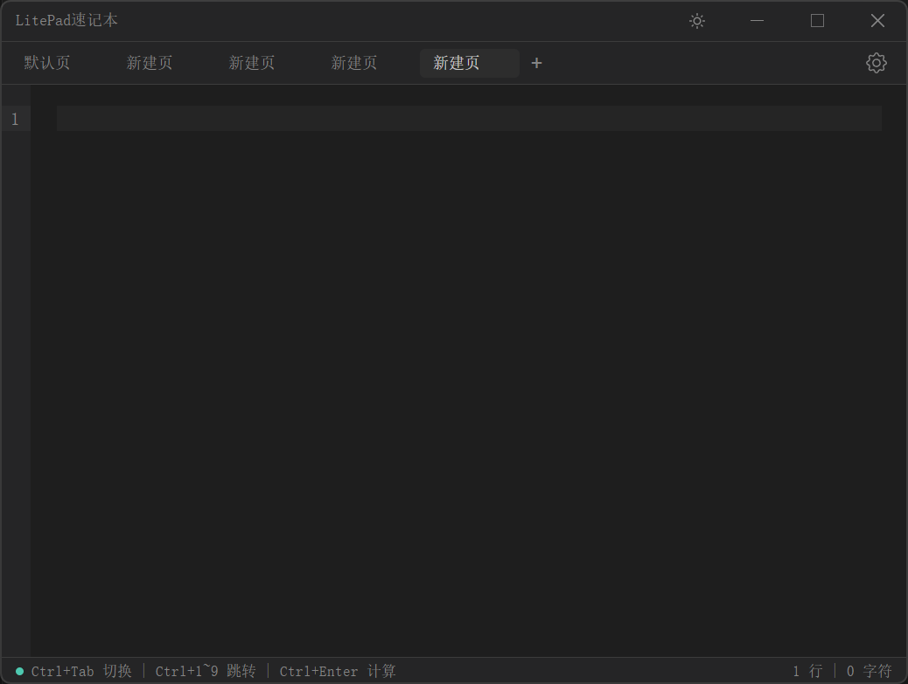

# LitePad

[English](./README_EN.md)

随手记的草稿本，快捷键呼出，用完即走。

## 功能

**编辑器**
- 多标签页管理（支持右键菜单重命名、关闭）
- 快捷计算（输入 `1+1=` 按 Ctrl+Enter 即得结果）
- 自动保存内容

**快捷键**
- 全局快捷键呼出 (Alt+X)
- 自定义快捷键（新建/关闭标签页）
- 标签页快速切换 (Ctrl+Tab, Ctrl+1~9)

**个性化**
- 多语言支持（中文/英文）
- 自定义界面字体和编辑器字体
- 开机自启动
- 窗口置顶
- 窗口位置和大小记忆

## 截图

**▼ 主界面**



## 开发

```bash
npm install
npm run dev        # 开发
npm run build:win  # 打包
```

## 许可证

MIT
