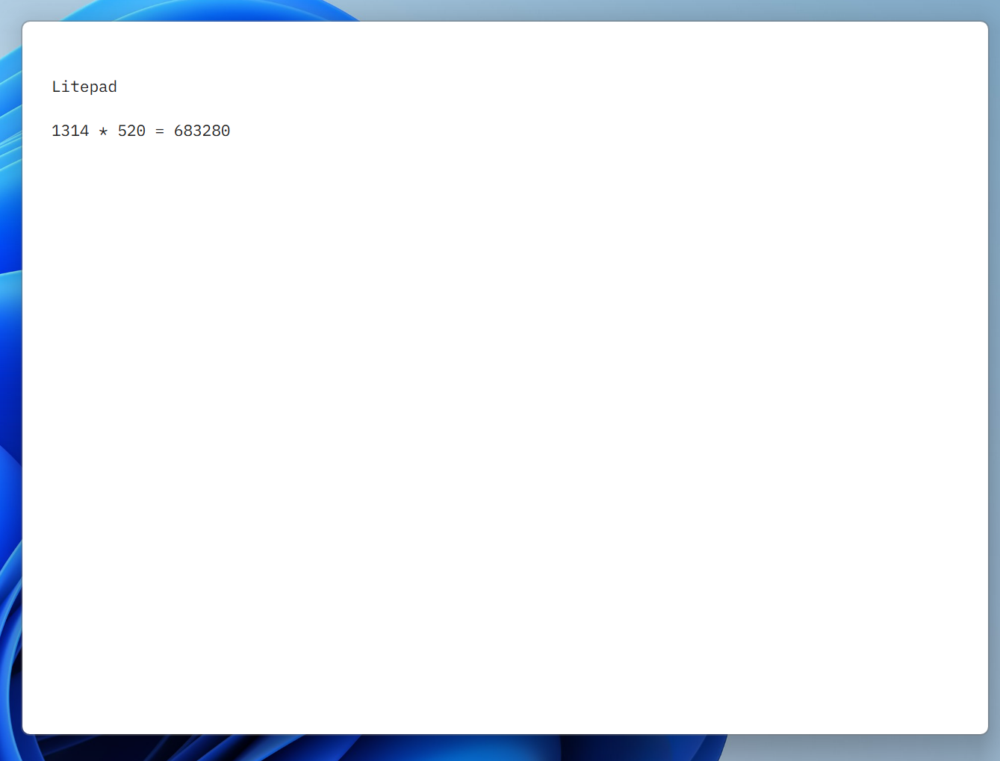

# LitePad

[中文](./README.md)

A scratchpad for quick notes. Hotkey to summon, use and go.

## Features

**Editor**
- Multi-tab management (right-click menu for rename/close)
- Quick calculation (type `1+1=` and press Ctrl+Enter to get result)
- Auto-save content

**Shortcuts**
- Global hotkey (Alt+X)
- Custom shortcuts (new/close tab)
- Quick tab switching (Ctrl+Tab, Ctrl+1~9)

**Personalization**
- Multi-language support (Chinese/English)
- Custom UI font and editor font
- Auto-launch on startup
- Always on top
- Window position and size memory

## Screenshots

**Normal Mode**


**Zen Mode**



## Development

```bash
npm install
npm run dev    # dev
npm run build  # build portable
```

## License

MIT
