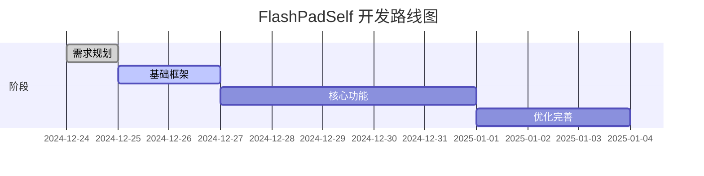
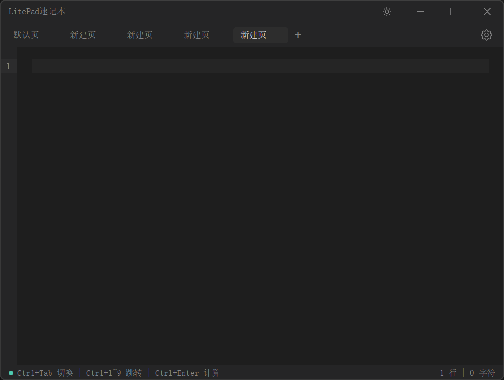

# 项目路线图

## 项目背景

现有的 FlashPad 软件存在一些编辑体验问题（如 Ctrl+Backspace 行为异常），因此决定自行开发一个类似的快速记事本工具。

## 核心目标

1. **极速响应** - 全局快捷键（Alt+X）toggle，毫秒级响应
2. **优秀编辑体验** - 正常的文本编辑行为
3. **本地离线** - 数据存储在本地，无网络依赖
4. **计算功能** - 输入表达式后按 Ctrl+Enter 计算结果

## 技术栈

| 层级 | 技术选型 | 说明 |
|------|----------|------|
| 框架 | **Electron** | 托盘常驻 + 窗口 hide/show |
| 前端 | **React** | 组件化开发 |
| 编辑器 | **CodeMirror 6** | 轻量（~150KB）、高度可定制 |
| 数据存储 | **JSON 文件** | 简单易备份 |
| 样式 | **普通 CSS** | 无额外依赖 |
| 构建 | **Vite** | 快速开发构建 |

## 阶段概览

| 阶段 | 名称 | 状态 | 详情 |
|------|------|------|------|
| 01 | [需求规划](./phases/01-planning.md) | ✅ 完成 | 确定需求、技术栈、文档结构 |
| 02 | [基础框架](./phases/02-foundation.md) | 🟡 进行中 | Electron 项目初始化、窗口/托盘/快捷键 |
| 03 | [核心功能](./phases/03-core-features.md) | ⚪ 待开始 | 编辑器、标签页、数据持久化、计算 |
| 04 | [优化完善](./phases/04-polish.md) | ⚪ 待开始 | 主题、设置、性能优化、打包发布 |

## 参考界面

